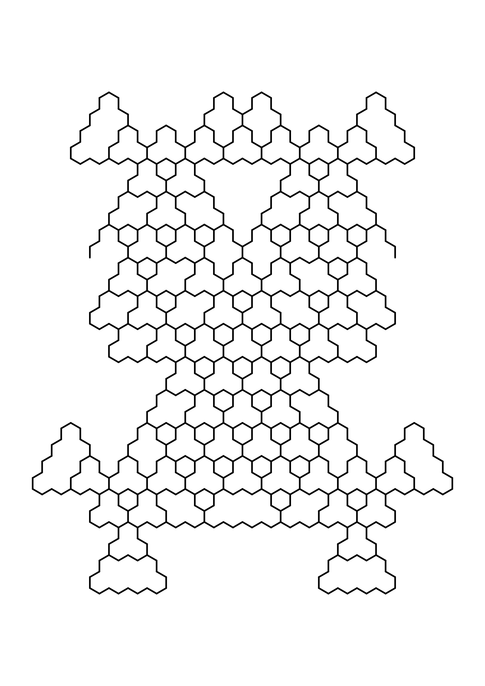

# L-System Experiments.

_very much alpha quality_

The idea to generate L-System rules on the fly occurred to me during Genuary 2024.

This repo is very much a "one-trick-pony"; the code intends to generate an image based on _reasonably_ sensible defaults set in  [lsys/config.toml](lsys/config.toml). I've since extended it to allow for rules to be passed into the program as an argument, but there are gaps in teh current implementation.

Rather than re-invent the wheel, the rules generated use the same commands
and syntax as the [Lindenmayer
System](https://en.wikipedia.org/wiki/L-system):

- `F` for "forward"
- `G` for "forward" (synonym for F)
- `+` for "turn anti-clockwise"
- `-` for "turn clockwise"
- `[` for "push"
- `]` for "pop"

If using the `extended-geometric`, `extended-stochastic` supplying your own rules, the following commands are also available:

- `(` for "turn anti-clockwise with increment"
- `)` for "turn clockwise with increment"
- `<` for "length *= scale"
- `>` for "length /= scale"
- `&` for "invert rotation"
- `#` for "increase weight"
- `|` for "rotate 180 degrees"


## Installation

The script uses standard Python3.11+; no external libraries are required.

## Examples

Parameters are set in [lsys/config.toml](lsys/config.toml).  Many of these parameters may be overridden on the command line.  To find the available flags, run `python3 lsys/lsys_main.py --help`.

```bash
# Generative L-System using defaults from config.toml
python3 lsys/lsys_main.py \ 
--paradigm=geometric
```



```bash
# Commandline defined L-System
python3 lsys/lsys_main.py \
--axiom X \
--rules '"X": "F+[[X]--X]-F[-FX]++X","F": "FF",' \
--recursion 15 \
--initial-angle 90 \
--rotation -20 \
--title "fractal fern-esque Fern"
```


## Reverse Engineering a Generated Image

Each svg will contain an html comment as the final object in the svg string.  For instance, the svg [here](Examples/F→F[-F]FF+FF.svg) contains the following comment:

```html
<!--
TITLE: LSYS PARAMS
PARADIGM: geometric
N: 4
AXIOM: F
RULES: {'F': 'F[-F]FF+FF'}
INITIAL_ANGLE: 90
ROTATE_ANGLE: 90.0
LINE_LENGTH: 150
CREATED: 2026-07-12 11:34:51
-->
```

You can use this to create an exact replica of the generated image by passing the parameters to the script as arguments:

```bash
python3 lsys/lsys_main.py \
--axiom 'F' \
--rules '"F": "F[--F]FF+FF"' \
--recursion 4 \
--initial-angle 30 \
--rotation 90 \
--title "RECONSTRUCTED LSYS PARAMS"
```
This can be used to tweak the image for instance by altering the rule, initial angle, or recursion depth.

Further examples can be found in the [Examples](Examples/) directory.

## Optimising for Pen-plotting / File Size

The script comes with three flags designed to improve the performance of these images when using a pen-plotter:

`--merge` will merge consecutive line segments
`--optimise-travel` will reorder the line segments to minimise the distance between consecutive line segments
`--compound-paths` will create compound paths for each group of lines

Though they can be used in isolation, the best results will be achieved by using all three flags together.  The `config.toml` configuration file can be used to set these.  By default these optimisations are turned off; they slow down the generation process, and make (text) editing of the svg more difficult.

Of less use to pen-plotters, is the `--precision` flag.  This flag controls the number of decimal places to round coordinate geometry to.  Setting this to 0 will result in integer coordinates, which will reduce the file size of the SVG, at the cost of slightly less precise geometry.  As the script scales the output to fit the paper-size, there's a compounding effect, but practically there appears to be little perceivable difference between the two settings, other than file size. As such, the default is to set precision to 0 decimal places.

